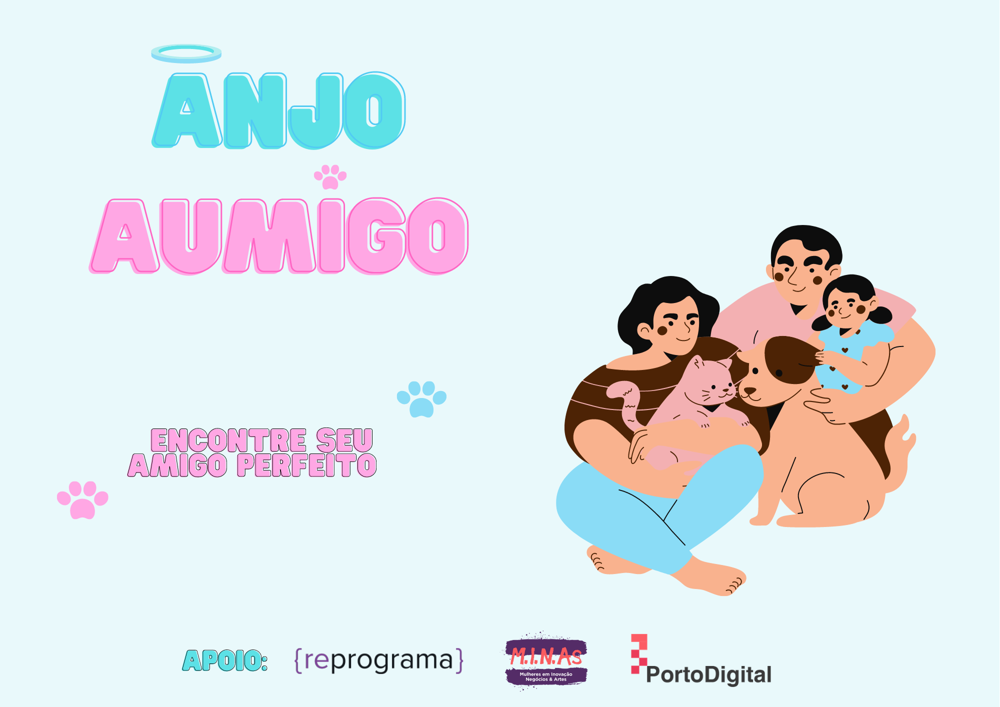

    <h1>Projeto Final: AnjoAumigo 🐾</h1>
    

O presente projeto é referente ao Bootcamp Back-End da {Reprograma} em parceria com o Porto Digital MINAS e tem como objetivo aplicar todo o conhecimento obtido através do curso.

## Motivação do tema escolhido
- Durante a pandemia, vi crescer o número de pets em estado de abandono e a procura de pessoas dispostas a adotá-los. Pesquisando a respeito, descobri que a OMS estima que haja no Brasil cerca de _30 milhões de animais abandonados_, sendo 10 milhões de gatos e 20 milhões de cachorros. Com a crise econômica durante o COVID-19, ainda mais animais foram abandonados por falta de suporte financeiro de seus tutores.

## Objetivo 🎯
- Como passei também pela experiência de cuidar de uma cachorrinha retirada das ruas antes de a mesma ir a um lar definitivo, senti a necessidade de **criar uma API que facilitasse a conexão dos animais abandonados**, e que estivessem em lares temporários, **a possíveis tutores "anjos" que tenham a disponibilidade e o carinho de cuidar desses animais** com muito amor.

## 💻 Tecnologias
- [Controle de Versionamento (Git)](https://git-scm.com/)
- [JavaScript](https://www.javascript.com/)
- [Gerenciamento de pactotes (npm)](https://www.npmjs.com/) 
- [Node](https://nodejs.org/en/)  
- [MongoDB](https://www.mongodb.com/) 
- [Heroku](https://dashboard.heroku.com/) 

🔰 Dependências 
- [Express](https://expressjs.com/pt-br/) 
- [Mongoose](https://mongoosejs.com/) 
- [Bcrypt](https://www.npmjs.com/package/bcrypt) 
- [Dotenv-safe](https://www.npmjs.com/package/dotenv) 
- [Jsonwebtoken](https://www.npmjs.com/package/jsonwebtoken) 
- [Nodemon](https://www.npmjs.com/package/nodemon) 

🔰 Utilitários
- Teste de API: [Postman](https://www.postman.com/downloads/) 
- Ícones: [Emojis para Github](https://gist.github.com/rxaviers/7360908)
- Paleta de cores: [Adobe Color](https://color.adobe.com/pt/)
- Criação da arte: [Canva](https://www.canva.com/)

## 👓 Funcionalidades
Haverá duas entidades (schemas) na inserção de dados: 
😇 Anjo (tutor para o pet) ou 
🐶 Pet em busca de lar amigo

✅ Login como usuário 

✅ Cadastrar um anjo/pet 

✅ Visualizar todos os anjos/pets cadastrados no sistema

✅ Buscar anjo por nome

✅ Buscar anjo pelo tipo de pet que deseja adotar

✅ Buscar pet pelo porte

✅ Buscar pet por nome

✅ Buscar pet por sexo

✅ Buscar pet por tipo

✅ Alterar dados do anjo/pet

✅ Deletar o cadastro de um anjo/pet
____
## 🚥 Rotas e features da API AnjoAumigo

Localmente, a API está rodando em `http://localhost:8080/`.

## 🚦😇 Anjos

| Método |  Rota                                        | Função                                       |
|:------:|----------------------------------------------| -------------------------------------------- |
| GET | `/` | Acesso à página inicial da API AnjoAumigo |
| GET | `/anjos` | Lista todos os anjos com interesse para adotar |
| GET | `/anjos/usertype?type=gato` | Lista todos os anjos que têm interesse em adotar determinado pet |
| GET | `/anjos/user?name=Name&email=nome@gmail.com` | Lista o anjo com interesse para adotar |
| POST | `/anjos` | Cadastra um novo anjo com interesse para adotar |
| POST | `/anjos/login` | Acessa o banco de dados dos anjos |
| PUT | `/anjos/user?nome=Name&email=name@gmail.com` | Permite alteração de informações sobre o anjo |
| DELETE | `/anjos/user?nome=Name&email=name@gmail.com` | Permite deletar informações sobre o anjo |

## 🚦🐶 Pets

| Método | Rota                                    | Função                                    |
|:------:|-----------------------------------------| ----------------------------------------- |
| GET | `/pets` | Lista todos os pets disponíveis a adoção | 
| GET | `/pets/user?name=Name&tutor=TutorName` | Lista todos os pets disponíveis a adoção |
| GET | `/pets/user/sex?sexo=macho` | Lista todos os pets do sexo determinado |
| GET | `/pets/user/size?porte=pequeno` | Lista todos os pets do porte determinado |
| GET | `/pets/type?=gato` | Lista todos os pets de determinado tipo |
| POST | `/pets` | Cadastra um novo pet para adoção |
| POST | `/pets/login` | Acessa o banco de dados dos anjos |
| PUT | `/pets/pets?nome=Name&tipoPet=cachorro` | Permite alteração de informações sobre o pet |
| DELETE | `/pets/pets?nome=Name&tipoPet=cachorro` | Permite deletar informações sobre o pet |

## 📚 Aprendizados 
Ao longo do Bootcamp, pude estudar e pôr em prática meus conhecimentos em ES6, lógica de programação, controle de versionamento, Node, MongoDB, Heroku e autenticação através das entregas semanais obrigatórias e exercícios extras feitos durante as aulas e monitorias. Poder reunir todos os conhecimentos obtidos no curso em um só projeto foi desafiador e, ao mesmo tempo, incrível, por poder ver o quanto aprendi e me desenvolvi em pouco tempo.

## 🌟 Agradecimentos
- Eu só tenho a agradecer à [{Reprograma}](https://reprograma.com.br/) e ao [Porto Digital MINAS](https://www.portodigital.org/capital-humano/iniciativas-para-a-diversidade/mulheres-em-inovacao-negocios-e-artes-minas) pela iniciativa de fazerem um bootcamp completamente acessível e remoto para as estudantes, pois isso leva oportunidade a cada vez mais mulheres que lutam pela transição de carreira ou para se firmar no mundo de TI. 
- Quero agradecer também à minha turma Back-End, que foi sensacional, muito unida e que fez de uma sala de aula virtual um ambiente de segurança, em que pudemos compartilhar muitos bugs e dicas, além de se dar apoio emocional e moral quando era preciso. A todas, minha mais sincera gratidão 💜

## 📃 Licença
Esse repositório está licenciado pelo **MIT License**.
____

    Developed with 💜 by <b>Thaísa Elvas</b> :octocat: 

    
    <a>
    

